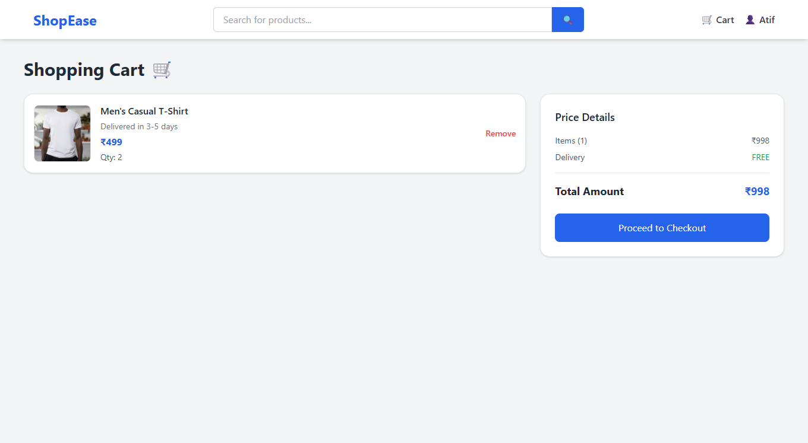
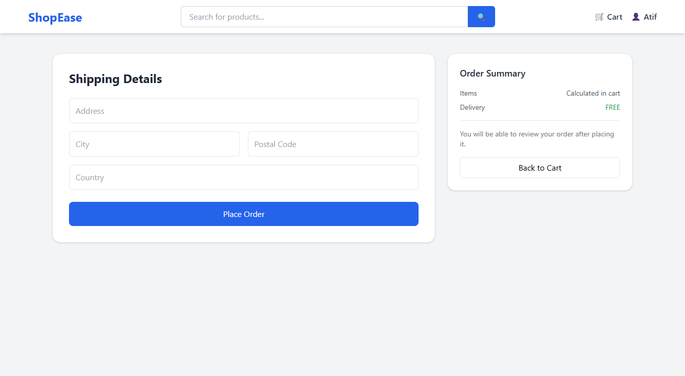
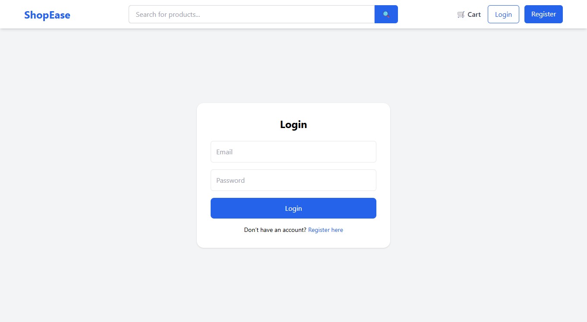
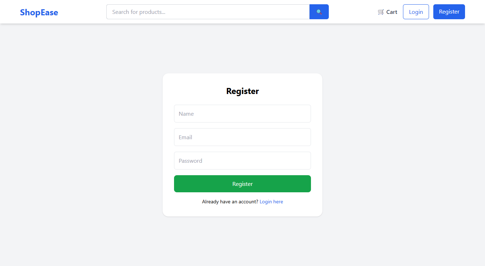

# 🛒 MERN E-Commerce App

A full-stack e-commerce web application built using the MERN stack (MongoDB, Express, React, Node.js).  
This project includes user authentication, product management, cart system, and order processing with a modern UI.

---

## 🚀 Features

- 🔐 User Authentication (JWT-based login/register)
- 🛍️ Product Listing with Categories
- 📦 Product Detail Page
- 🛒 Add to Cart & Remove from Cart
- 💳 Checkout & Order Placement
- 👤 User Profile with Order History
- 🛠️ Admin Product Management (Create, Update, Delete)
- 🎨 Modern UI with Tailwind CSS

---

## 🛠 Tech Stack

### Frontend
- React.js
- Tailwind CSS
- Axios
- React Router

### Backend
- Node.js
- Express.js
- MongoDB (Mongoose)
- JWT Authentication

---

## 📸 Screenshots

### 🏠 Home Page


### 🏠 Home Page (Alt View)


### 📦 Product Page


### 🛒 Cart Page


### 💳 Checkout Page


### 🔐 Login Page


### 📝 Register Page


---

## ⚙️ Installation & Setup

### 1️⃣ Clone Repository
```bash
git clone https://github.com/TechieParvez/mern-ecommerce-app.git
cd mern-ecommerce-app
